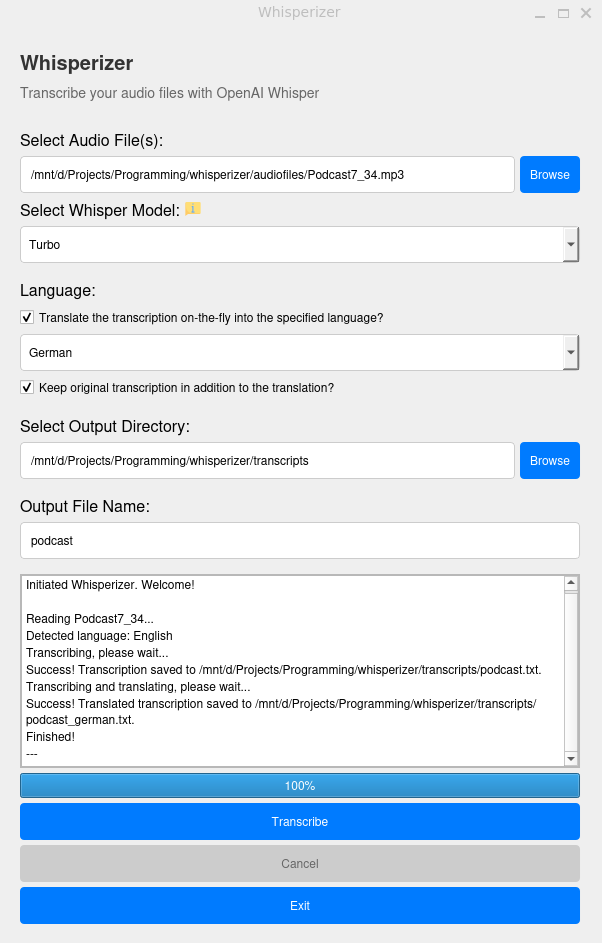

# Whisperizer - Transcription tool using OpenAI's Whisper

Transcription is a tedious work, often very time-consuming and prone to errors. OpenAI developed a model to make this work more efficient: [Whisper](https://openai.com/index/whisper/). Using this, you can relax and let your machine do all the work. However, you need some programming skills to actually use the API.

As automated transcription is something with a very broad target audience, I created this Graphical User Interface (GUI)-based tool called Whisperizer, which brings along multiple additions such as translation, model selection, multiple file support, automated file naming and others to the transcription realm.

## What can it do

Note that this work is in progress. The vision is a (Web)App, available either locally or directly online with access to a CUDA-enabled GPU machine, with multiple additions and Quality of Life improvements for an actual easy-to-use, multi-purpose transcription suite.

### So far available
 - Transcribe single or multiple audiofiles in common formats to textfiles
 - Translate the transcription to a variety of languages
 - A GUI for more accessible transcription and translation services

### Planned (see issues)
- Diarization (speaker detection)
- GUI enhancement and bugfixing (Cancel button and progress bar)
- Improve file management and enable conversion of input files
- Enhance documentation and setup adaptation (especially CUDA-less environments)
- Create a standalone (Web)App to make this actually accessible, as so far it still needs setup/CLI knowledge

## Installation

> There are two supported options to create new virtual environments and install the according dependencies, Mamba/Conda and Venv + Pip.
> Using [Mamba](https://mamba.readthedocs.io/en/latest/index.html) is recommended.

Using [Mamba](https://mamba.readthedocs.io/en/latest/index.html) (if using [Conda](https://docs.conda.io/en/latest/), replace `mamba` with `conda` below):

```shell
mamba env create --file environment.yaml
mamba activate whisperizer
```

Using venv and pip (built-in):

```shell
sudo apt install python3.11 # if not installed already
python3.11 -m venv .venv
source .venv/bin/activate
python3.11 -m pip install -r requirements.txt
```

> **Note about required space**<br/>
> Despite the low number of dependencies, the environment will still have a size of around 5.5 GB. Depending on the selected model, another 73 MB (tiny) to 3 GB (large-v1) space will be required. The default model turbo needs 1.6 GB space and delivers the best balance between resource cost and performance.

## Usage

Start the GUI with:

```shell
python src/main.py
```

You don't need to do anything else, the rest is done inside the GUI.

> **Note about expected runtime**<br/>
> If you have a modern CUDA-enabled GPU on your machine (e.g., RTX 3060 Ti), the tool is quite fast (talking mere seconds per minute of audio). However, GPU-less systems using only the CPU will take considerably longer (talking nearly 1:1 processing). The values are just an orientation what to expect, this strongly depends on your machine.

### GUI

The following image shows the GUI after a finished transcription and translation with all options checked on an Ubuntu (Linux) system:



By hovering over the elements, you get tooltips with a short description what they do. The main elements are:

1. File management (input file, output folder, output file name)
2. Selecting the model (more info [here](https://github.com/openai/whisper?tab=readme-ov-file#available-models-and-languages), also available by clicking the info icon)
3. Selecting the language for translation and the option to keep the transcription in addition to the translation
4. A logging window which display status and current task with a progress bar
5. Control buttons to start and cancel the transcription as well as closing the GUI

## Contribution

Any advice, proposal for improvement, or question is welcome on all communication channels!

If you want to contribute code, please use pre-commit by running:

```shell
pre-commit install
```

Using this, it is ensured that the code you provide suits the custom formatting rules before committing or creating a pull request.

## License

This project is licensed under the MIT License - see the [LICENSE file](./LICENSE) for details.
